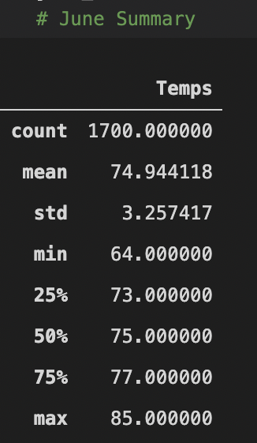

# Surfs up
## Project Overview
Client wants to open up a business in Oahu. This analysis looks into climate data of the location to figure out information about temperature trends and if the business will be sustainable all year-round. 
## Results
- Weather differences between June and December, the average temperature drops by about 3~4 degrees. 
- While the max temperature peaks out around 84 degrees for both months, the minimum in december drops a lot lower to 56 degrees as opposed to Jnue where the minimum is 64 degrees.  
- Between both months the average temperature still remains above 70 degrees.

   

## Summary
In summary, the analysis of the climate data finds the temperature trend of the location in general averages around 70 degrees with the maximum of around 84 degrees. With the results of the analysis it looks like the surf and ice cream shop will be able to sustain itself all year-round. 

While in december and in winter months the minimum temperature might dip to around 55 degrees, given the average temperature it is safe to conclude the business will not be affected. Two additional queries that i would perform would be to find out the precipitation levels between the two months as it impacts how many people will be outdoors followed by the relationship between elevation level and the amount of precipitaion it gets. 
